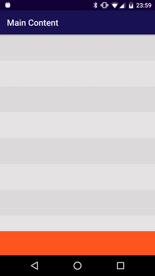
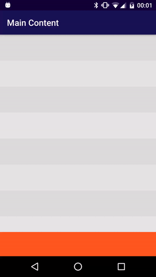
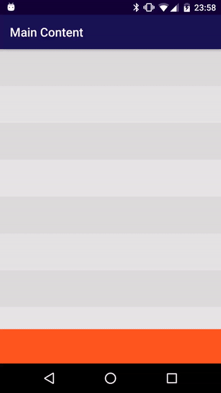

# BottomSheetCoordinatorLayout

**24/11/16 This is not a fully working implementation**

An attempt to use Coordinator Layouts in Bottom Sheets!
There is also a [question][stckovrflw] on Stack Overflow that is yet waiting for a decent answer.

| Custom behavior                           | (Issues)                                         |
| ----------------------------------------- | ------------------------------------------------ |
| :heavy_check_mark: nested scrolling works | :x: toolbar sometimes collapses too early        |
| :heavy_check_mark: toolbar can be dragged | :x: toolbar cannot be collapsed through drags    |
|                                           | :x: main coordinator layout consumes some scroll |
|      |             |

| Android default behavior (unsupported)    |
| ----------------------------------------- |
| :x: cannot close by nested scrolling      |
|    |

[stckovrflw]: <http://stackoverflow.com/q/36229911/4744332>
